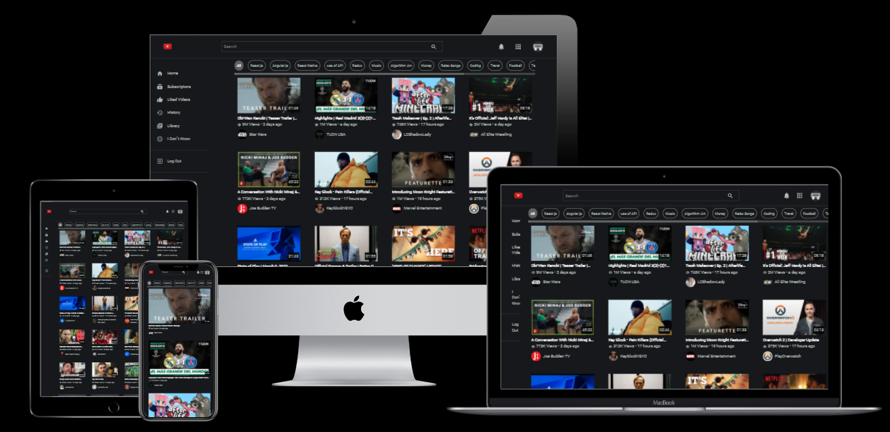

<div align="center">
  <a href="https://github.com/othneildrew/Best-README-Template">
    
  </a>

  <h3 align="center">Youtube Clone App</h3>

  <p align="center">
    <a href="https://you-tube-theone.web.app/">View Demo</a>
    ·
    <a href="https://github.com/UAsad99/YouTube-Clone/issues">Report Bug</a>
    ·
    <a href="https://github.com/UAsad99/YouTube-Clone/issues">Request Feature</a>
  </p>
</div>

<!-- TABLE OF CONTENTS -->
<details>
  <summary>Table of Contents</summary>
  <ol>
    <li>
      <a href="#about-the-project">About The Project</a>
      <ul>
        <li><a href="#built-with">Built With</a></li>
      </ul>
    </li>
    <li>
      <a href="#getting-started">Getting Started</a>
      <ul>
        <li><a href="#prerequisites">Prerequisites</a></li>
        <li><a href="#installation">Installation</a></li>
      </ul>
    </li>
    <li><a href="#usage">Usage</a></li>
    <li><a href="#contact">Contact</a></li>
  </ol>
</details>

<!-- ABOUT THE PROJECT -->
## About The Project



You can <b>Search Youtube Vidoes</b>, <b>Watch & Share Videos</b>, <b>See Video Comments & Likes Count & Youtube Channel Videos - Subscribers</b> through this Clone App.
See Demo and Relax!

### Built With

* [React.js](https://reactjs.org/)
* [Bootstrap](https://getbootstrap.com)
* [Firebase](https://firebase.google.com)
* [Redux](https://redux.js.org/)
* [React Router Dom](https://reactrouter.com)
* [SCSS](https://sass-lang.com/)

<!-- GETTING STARTED -->
## Getting Started

### Prerequisites

This is an example of how to list things you need to use the software and how to install them.
* npm
  ```sh
  npm install npm@latest -g
  ```

### Installation

1. Get a free Youtube API Key at [https://console.cloud.google.com](https://console.cloud.google.com)
2. Clone the repo
   ```sh
   git clone https://github.com/UAsad99/YouTube-Clone.git
   ```
3. Open Project Folder
   ```sh
   cd Youtube-Clone
   ```
4. Install NPM packages
   ```sh
   npm install
   ```
5. Enter your Youtube Api Key in `src/api.js`
   ```js
   const request = axios.create({
      baseURL: "https://youtube.googleapis.com/youtube/v3/",
      params : {
        key: "Your-Youtube-Api-Key" // Paste here your YouTube Api Key
      }
   });
   ```
6. Enter your Firebase Config Object in `src/firebase.js`
   ```js
   const firebaseConfig = {
      // Initialize Firebase
   }
   ```
7. Start Project in localhost:3000
    ```sh
    npm start
   ```

<!-- USAGE EXAMPLES -->
## Usage

_See [Documentation](https://developers.google.com/youtube) to understand Youtube Api_

<!-- CONTACT -->
## Contact

Asad - [Telegram](https://t.me/ua_tm) - uasad99@gmail.com

Project Link: [https://github.com/UAsad99/YouTube-Clone](https://github.com/UAsad99/YouTube-Clone)
